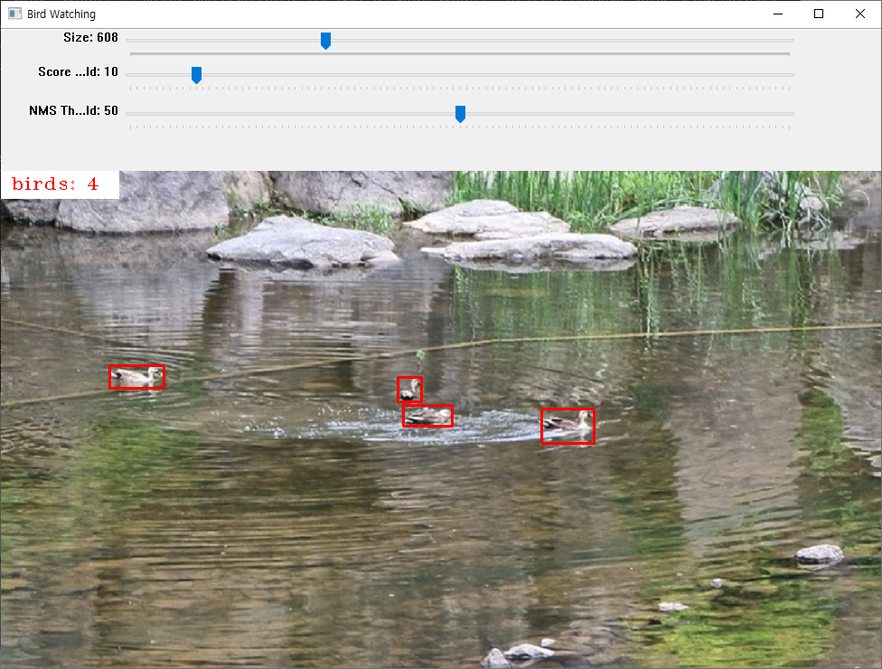

# Birdwatching

## 목표
1. 비실시간 개체수 검출
2. 실시간 개체수 검출
3. 라즈베리파이를 이용해 야생에서 개체수 검출
4. 생김새에 따른 종 분류
5. 울음소리에 따른 종 분류

## 진행 상황
1. YOLOv4 사용 (yolo.py)
2. 정지영상 개체수 검출 후 결과 저장 (detect.py)

  트랙바를 추가하여 프로그램 실행 중 매개변수 (Size, Score Threshold, NMS Threshold) 변경 가능

  명령행 인자로 매개변수를 입력 가능
    

3. 동영상 개체수 검출 후 결과 저장 (detect_video.py)

## Reference
* [YOLOv4: Optimal Speed and Accuracy of Object Detection](https://arxiv.org/abs/2004.10934)
* [Darknet](https://github.com/AlexeyAB/darknet)
* [YOLO object detection using Opencv with Python](https://pysource.com/2019/06/27/yolo-object-detection-using-opencv-with-python)
