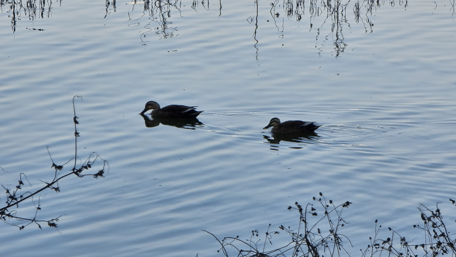
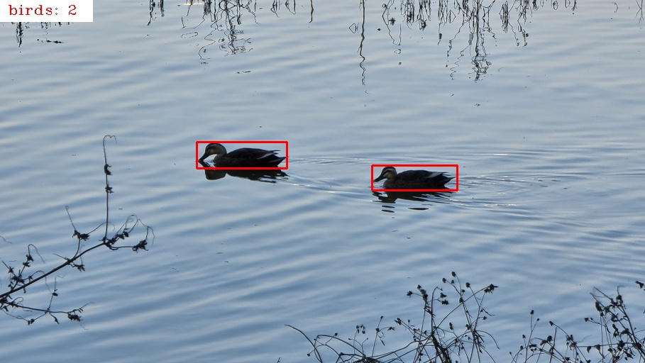

# Birdwatching

## 목표
1. 비실시간 개체수 검출
2. 실시간 개체수 검출
3. 라즈베리파이를 이용해 야생에서 개체수 검출
4. 생김새에 따른 종 분류
5. 울음소리에 따른 종 분류

## 진행 상황
1. YOLOv4 사용 (yolo.py)
2. 정지영상 개체수 검출 후 결과 저장 (detect.py)

3. 동영상 개체수 검출 후 결과 저장 (detect_video.py)
